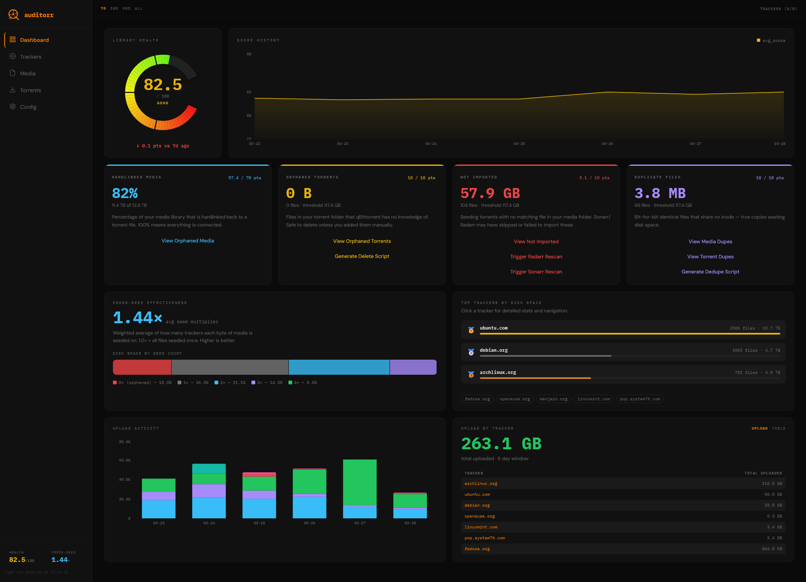

# auditorr

auditorr shows you exactly what’s happening inside your media library.

It cross-references your hardlinked torrent and media directories with qBittorrent to generate a real-time health score, detecting orphaned files, duplicates, missing links, and calculates tracker statistics.



- **Health score (0–100)** — see how clean and efficient your library is
- **Find wasted disk space** — duplicates, orphaned files, unlinked torrents with one-click delete and dedupe scripts
- **Upload analytics & library yield** — daily upload volume per tracker, yield % over time, tracker leaderboard
- **Cross-seeding insights** — weighted average seed multiplier, segmented disk bar, per-tracker breakdown
- **Powerful file explorer** — tree and flat views, filter by status, tracker, seed count, size, filename
- **Sonarr/Radarr integration** — open orphaned media directly in Sonarr or Radarr for interactive search
- **Guided setup** — first-run wizard connects qBittorrent, verifies your paths, and optionally sets up Sonarr/Radarr

---

## Who is this for?

auditorr is built for self-hosted media setups using qBittorrent + Sonarr/Radarr with hardlinks, following the [TRaSH Guides](https://trash-guides.info/File-and-Folder-Structure/).

The health score reflects how well your library is actually connected and seeding.

---

## Installation

### Instant Quick Start

```bash
docker run -d \
  --name auditorr \
  -p 8677:8677 \
  -v /mnt/user/appdata/auditorr/data:/app/data \
  -v /mnt/user/data:/data:ro \
  ghcr.io/thrill-burn/auditorr:latest
```

Then open `http://your-server-ip:8677`. On first launch, a setup wizard will guide you through connecting qBittorrent and configuring your data paths.

### unRaid (Recommended)

Docker tab → Add Container button at the bottom and fill in the blanks:

- **Name:** `auditorr`
- **Repository:** `ghcr.io/thrill-burn/auditorr:latest`
- **Icon URL:** `https://raw.githubusercontent.com/thrill-burn/auditorr/main/docs/icon.png`
- **WebUI:** `http://[IP]:[PORT:8677]/`
- **App Path:** `/mnt/user/appdata/auditorr/data` → `/app/data`
- **Data Path:** `/mnt/user/data` → `/data`
- **Port Mapping:** `8677 → 8677`

Press the Apply button, let the container install, then open `http://your-server-ip:8677`. The setup wizard will guide you through the rest.

### Docker Compose

```yaml
services:
  auditorr:
    image: ghcr.io/thrill-burn/auditorr:latest
    container_name: auditorr
    restart: unless-stopped
    ports:
      - "8677:8677"
    volumes:
      - /mnt/user/appdata/auditorr/data:/app/data
      - /mnt/user/data:/data:ro
      # TRaSH folder defaults, change if required
    environment:
      - AUDITORR_PORT=8677
      # Uncomment to enable authentication:
      # - AUDITORR_SECRET=your-secret-key
```

### Build from source

```bash
git clone https://github.com/thrill-burn/auditorr.git
cd auditorr
docker build -t auditorr .
docker run -d \
  --name auditorr \
  -p 8677:8677 \
  -v /mnt/user/appdata/auditorr/data:/app/data \
  -v /mnt/user/data:/data:ro \
  auditorr
```

---
## Important

auditorr assumes a **hardlink-based setup**.

If you are not using hardlinks, your health score will be low even if your library appears functional.

---

## Will this break my library?

No. auditorr is designed from the ground up to be read-only and non-destructive.

- **Your media is physically read-only** — the Docker volume mount uses the `:ro` flag. auditorr cannot write, move, or delete any file in your media or torrent directories at the OS level, regardless of what any code does.
- **qBittorrent access is read-only** — auditorr only calls qBittorrent's read endpoints (torrent list, file list, tracker list). It never pauses, removes, or modifies any torrent or tracker.
- **No direct tracker communication** — auditorr never connects to your trackers. All tracker information (names, stats, upload data) is pulled from qBittorrent's local API, which already has that data. Your tracker relationships stay between you and qBittorrent.
- **Scripts are yours to review** — the delete and dedupe scripts are plain text bash files. auditorr never executes them — you download, read, and run them yourself.
- **Your credentials stay local** — Sonarr, Radarr, and qBittorrent credentials are stored in a SQLite database on your server and masked in the UI. Never sent anywhere except your own LAN instances.
- **No external connections** — auditorr makes no outbound requests to the internet. Every API call goes to your own qBittorrent, Sonarr, or Radarr on your LAN.
- **LAN-only by default** — the web UI is accessible only from private network IP ranges. No telemetry, no analytics, no phone-home.

---
## Configuration

All configuration is done through the **Config** tab in the UI.

| Setting | Description |
|---|---|
| **qBittorrent Host** | URL of your qBittorrent instance, e.g. `http://192.168.1.x:8080` |
| **Test Connection** | Verifies credentials and shows qBittorrent version, torrent count, and seeding size |
| **qBit Save Path** | The path qBittorrent reports via its API. Use **Fetch from qBittorrent** to auto-populate. |
| **Local Torrent Path** | Where those files actually live from auditorr's perspective (may differ if qBit runs in its own container) |
| **Media Path** | Your final media library directory |
| **Test Paths** | Verifies that Media Path and Local Torrent Path are visible inside the container, with per-path ✓/✗ feedback |
| **Browse container filesystem** | Expandable `/data` directory browser — click any directory to fill Media Path or Local Torrent Path |
| **Watchdog Cooldown** | Seconds to wait after a filesystem change before running an audit (default: 60) |
| **Scheduled Interval** | Fallback audit interval in minutes (default: 360) |
| **Thresholds** | Percentage of library at which each category loses all its points |
| **Sonarr URL** | URL of your Sonarr instance, e.g. `http://192.168.1.x:8989`. Must be browser-accessible (LAN IP). |
| **Sonarr API Key** | Found in Sonarr → Settings → General |
| **Radarr URL** | URL of your Radarr instance, e.g. `http://192.168.1.x:7878`. Must be browser-accessible (LAN IP). |
| **Radarr API Key** | Found in Radarr → Settings → General |
| **Sonarr Remote Path** | Path to downloads as Sonarr sees it inside its container. Leave blank if paths are the same. |
| **Radarr Remote Path** | Same for Radarr. |
| **Exclusion Patterns** | Glob patterns (one per line) to exclude files from health scoring. e.g. `*.srt`, `@eaDir` |

### Environment variables

| Variable | Default | Description |
|---|---|---|
| `AUDITORR_PORT` | `8677` | Port to listen on |
| `AUDITORR_SECRET` | *(unset)* | If set, all API routes require `X-Auditorr-Secret: <value>` header |
| `DATA_DIR` | `/app/data` | Where config, history, and SQLite db are stored |

---

## Health Score

| Component | Max Points | Description |
|---|---|---|
| Hardlinked Media | 70 | % of media library hardlinked back to a torrent file |
| Orphaned Torrents | 10 | Files in media folder unknown to qBittorrent |
| Not Imported | 10 | Seeding torrents with no matching media file |
| Duplicate Files | 10 | Bit-for-bit identical files sharing no inode |

For the 10-point categories, points are lost linearly as problem data grows toward the configured threshold. At the threshold, all 10 points are gone.

---

## License

MIT — see [LICENSE](LICENSE)
