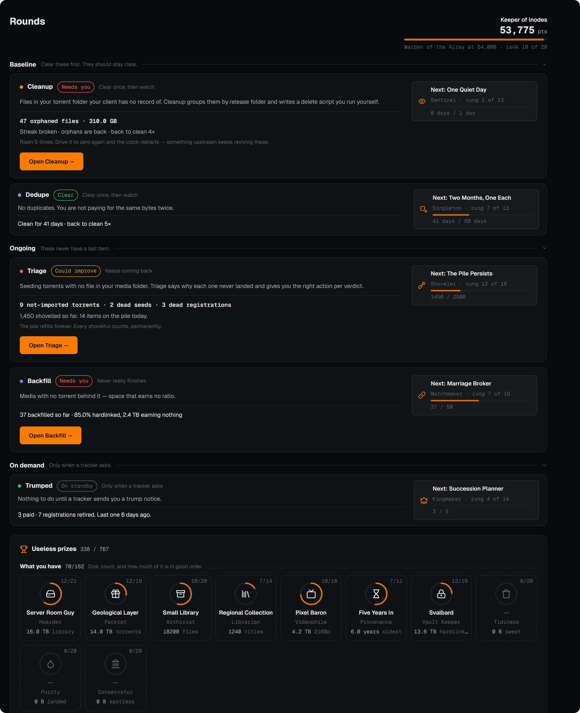
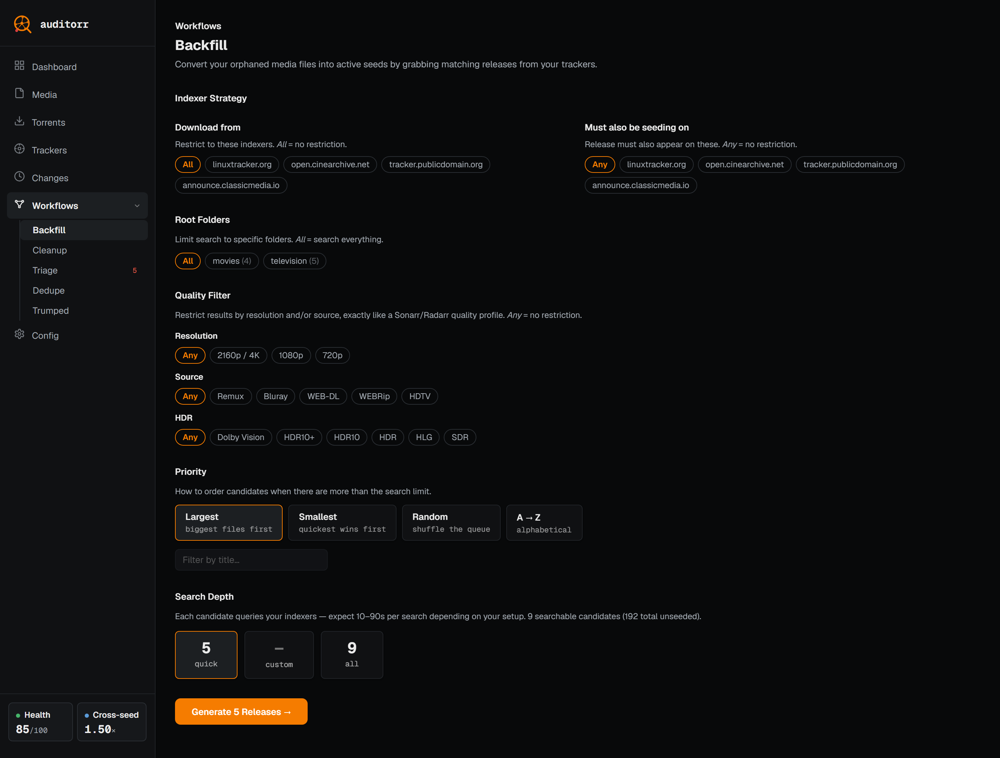
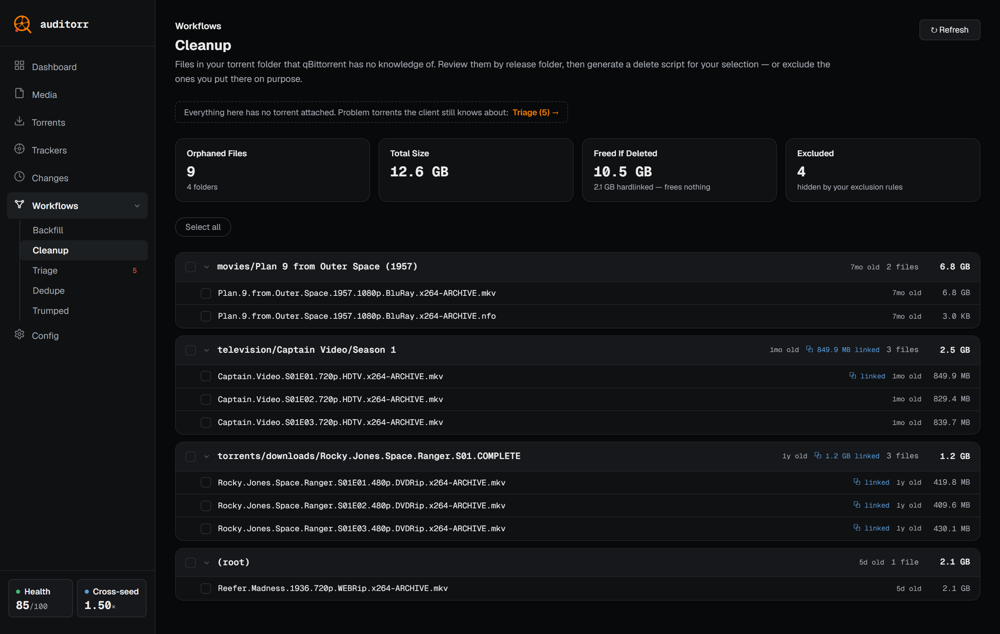
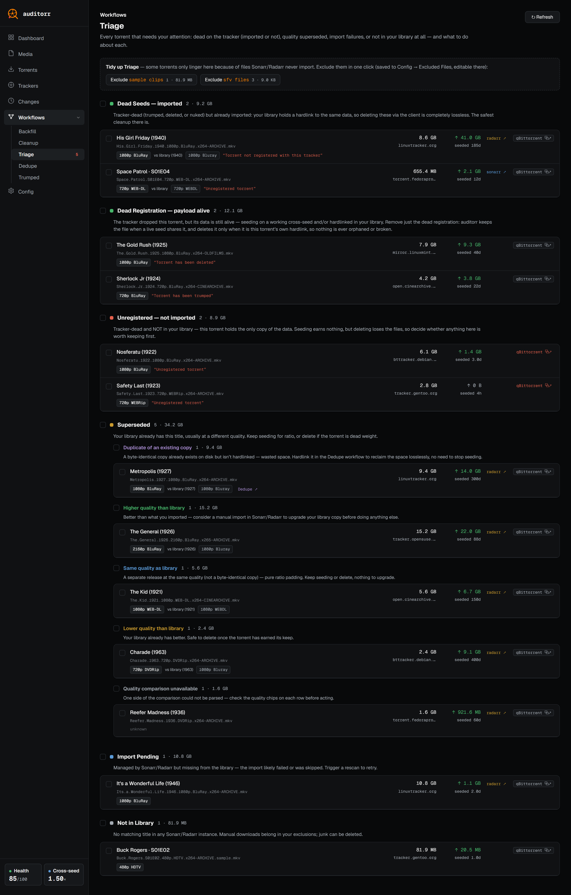
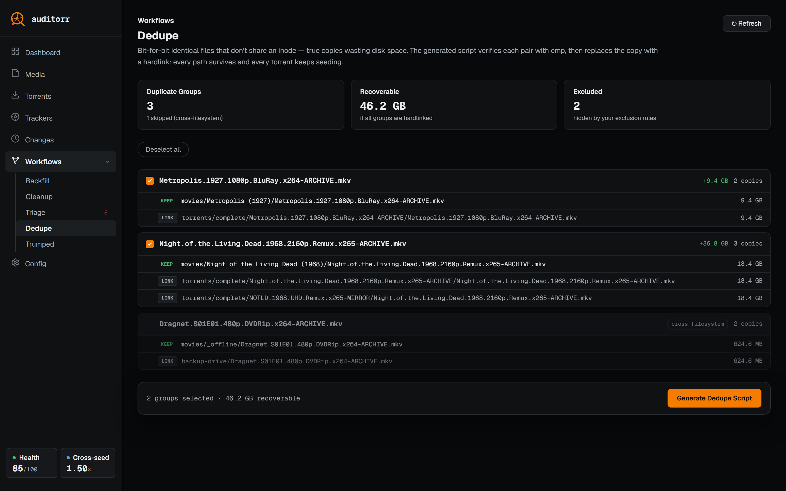
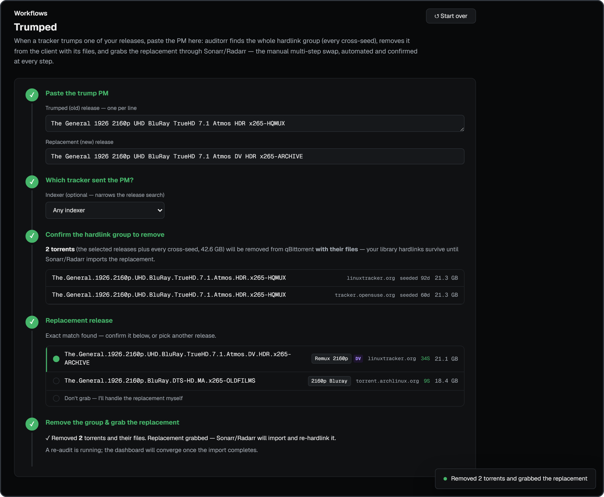

# auditorr

**An audit tool for hardlinked media libraries using qBittorrent / qui + Sonarr / Radarr.**
A dashboard with health score, per-tracker analytics, and cross-seed effectiveness 
tells you what's wrong with your library. Five automated workflows fix it.

<p align="center">
  <a href="docs/configuration.md">Configuration</a> ·
  <a href="docs/remote-access.md">Remote access</a> ·
  <a href="docs/troubleshooting.md">Troubleshooting</a>
</p>

<p align="center">
  <a href="docs/dashboard.png">
    
  </a>
</p>

---

## What's new in 1.7.3

- **[How you got here](#rounds)** - a dated record of every prize you've earned, at the foot of Rounds. Upgrading doesn't start it empty: auditorr replays your audit log and dates everything that log can prove.
- **Prizes for a library that's already tidy** - the shelf used to go quiet for exactly the people who'd done the work. Eleven new ladders aim at that, including the largest library you've ever held with nothing wrong with it, and everything you seed multiplied by how long you've held it.
- **[File Explorer can say "not"](docs/configuration.md#excluded-files--folders)** - *Duplicates* and *Excluded* are their own `+` / `-` toggles now, so **orphaned but not excluded** is finally a question you can ask.
- **Multiple Sonarr / Radarr instances actually work (#22)** - adding one to the additional-instances list used to switch your primary off. Upgrading is the whole fix.
- **Every workflow's prize is now the work you did**, not the size of your drives - and acting on a row updates the sidebar, the dashboard and the other pages straight away.

## What's new in 1.7.2

- **[Rounds](#rounds)** - a new page that tells you which workflows your library needs right now, which to do first, and keeps score with useless prizes.
- **Force import** - [Triage](#triage) can now replace a same-quality file Sonarr / Radarr refuses to upgrade, using their own *Import Anyway*.
- **Health score weighting** - split the 100 points however you like, or stop scoring a category entirely. For setups that delete torrents once seeding is done.
- **External URLs** - a separate browser-facing address per service, for reverse proxies. Blank means "same as before".

Upgrading from 1.7.0 or earlier? 1.7.1 [closed off-LAN API access by default](docs/remote-access.md) - LAN is unaffected.

## What's new in 1.7.0

- **Optimized for large libraries** - backend memory optimizations, tested on libraries up to **500 TB**.
- **Four new workflows** - Backfill is now joined by Cleanup, Triage, Dedupe, and Trumped, so every dashboard problem has a fix.
- **A rebuilt UI** - a top-to-bottom design pass with consistent buttons and spacing, and a calmer library-health dial.

---

<table>
  <tr>
    <td width="50%" valign="top">
      <a href="docs/feature-media.png"></a>
      <p><b>Media explorer</b><br>
      Tree or flat view of your library. Click a file to see every hardlink
      sibling and which tracker is seeding it.</p>
    </td>
    <td width="50%" valign="top">
      <a href="docs/feature-torrents.png"></a>
      <p><b>Torrents</b><br>
      Every file qBittorrent / qui is seeding, with tracker, status, and
      reverse hardlink lookup.</p>
    </td>
  </tr>
  <tr>
    <td width="50%" valign="top">
      <a href="docs/feature-trackers.png"></a>
      <p><b>Trackers</b><br>
      Configurable chart of per-tracker analytics. Deep-link into the explorer pre-filtered
      by tracker.</p>
    </td>
    <td width="50%" valign="top">
      <a href="docs/feature-changes.png"></a>
      <p><b>Change log</b><br>
      File-level diff between every consecutive audit, kept indefinitely.</p>
    </td>
  </tr>
</table>

---

## Workflows

The dashboard tells you what's wrong; **workflows** fix it. **Rounds** tells you
which one to open.

### Rounds

Every workflow in one ranked list, in a fixed order you walk again and again:
**Baseline** you clear once and then watch, **Ongoing** never has a last item,
**On demand** waits for a tracker to ask. Each row states what it would cost you
to ignore it. Underneath sits a shelf of **useless prizes** — over 650 named
tiers and 109 one-off feats, in the spirit of Progress Quest, awarded for work
you were going to do anyway and never taken back. They keep going once your
library is tidy, which is when a prize layer usually gives up on you: the
largest library you've ever held with nothing wrong with it, everything you
seed multiplied by how long you've held it, your longest-lived single torrent.
Under it all is the record of how you got here — every rung and feat, dated, in
the order you earned them.

<p>
  <a href="docs/rounds.png"></a>
</p>

### Backfill

Targets *orphaned media*: files on disk with no hardlink to a seeding torrent
and no way to grow one (trumped, dead tracker, your own rip). Search the same
title on the tracker you want, grab a version that actually seeds, and swap it
in via Sonarr / Radarr.

<p>
  <a href="docs/backfill-config.png"></a>
</p>

### Cleanup

Targets *orphaned torrent files*: files in your torrent folder the client has
no torrent for. Review them grouped by release folder, then generate a reviewed
delete script — or exclude the ones you put there on purpose.

<p>
  <a href="docs/workflow-cleanup.png"></a>
</p>

### Triage

Explains every problem torrent and what to do about it: dead seeds, dead
registrations, unregistered, superseded quality, pending imports, and not in
library. Trigger a Sonarr/Radarr rescan, exclude, or delete torrents and their
files directly through qBittorrent / qui.

<p>
  <a href="docs/workflow-triage.png"></a>
</p>

### Dedupe

Targets *duplicate files*: review duplicate groups and generate a script that
replaces copies with hardlinks, verified with `cmp` before linking.

<p>
  <a href="docs/workflow-dedupe.png"></a>
</p>

### Trumped

Automates the private-tracker trump swap. Paste the tracker's "this release has
been trumped" PM; auditorr parses the old and new release names, finds the
entire hardlink group (every cross-seed of the old content), removes it from the
client with its files, and grabs the exact replacement through Sonarr/Radarr —
wizard-style, confirmed at every step.

<p>
  <a href="docs/workflow-trumped.png"></a>
</p>

---

## Install

### Unraid

auditorr is on **Unraid Community Apps** — search for `auditorr` in the
Apps tab and install in one click.

- **WebUI:** `http://[IP]:[PORT:8677]/`
- **Appdata:** `/mnt/user/appdata/auditorr/data` → `/app/data`
- **Data:** `/mnt/user/data` → `/data` (read-only)

### Docker Compose

```yaml
services:
  auditorr:
    image: ghcr.io/thrill-burn/auditorr:latest
    container_name: auditorr
    restart: unless-stopped
    ports:
      - "8677:8677"
    volumes:
      - ./data:/app/data
      - /path/to/media:/data/media:ro
      - /path/to/torrents:/data/torrents:ro
```

<details>
<summary><b>Build from source</b></summary>

```bash
git clone https://github.com/thrill-burn/auditorr.git
cd auditorr
docker build -t auditorr .
docker run -d \
  --name auditorr \
  -p 8677:8677 \
  -v /path/to/appdata:/app/data \
  -v /path/to/media:/data/media:ro \
  -v /path/to/torrents:/data/torrents:ro \
  auditorr
```

</details>

Something not working? See [Troubleshooting](docs/troubleshooting.md).

---

> [!IMPORTANT]
> The Hardlinked Media score assumes you use hardlinks between your torrent
> folder and your media library — the
> [TRaSH Guides](https://trash-guides.info/File-and-Folder-Structure/) folder
> structure. Without hardlinks, this score is 0 regardless of how healthy
> the rest of your library is.

---

## License

MIT — see [LICENSE](LICENSE).
