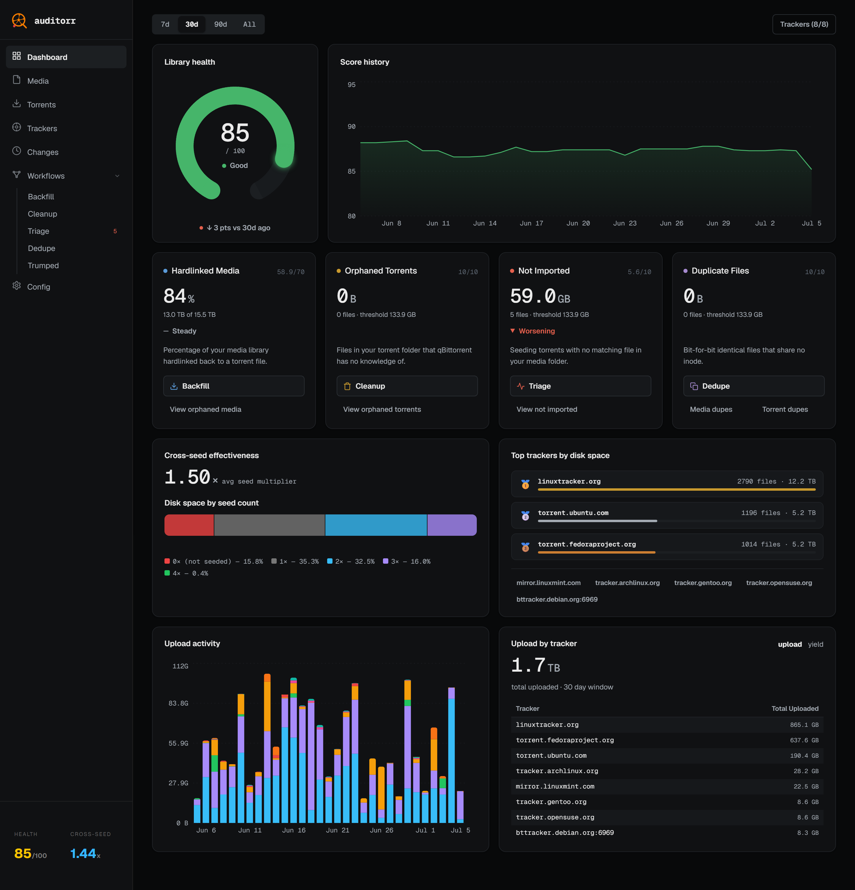
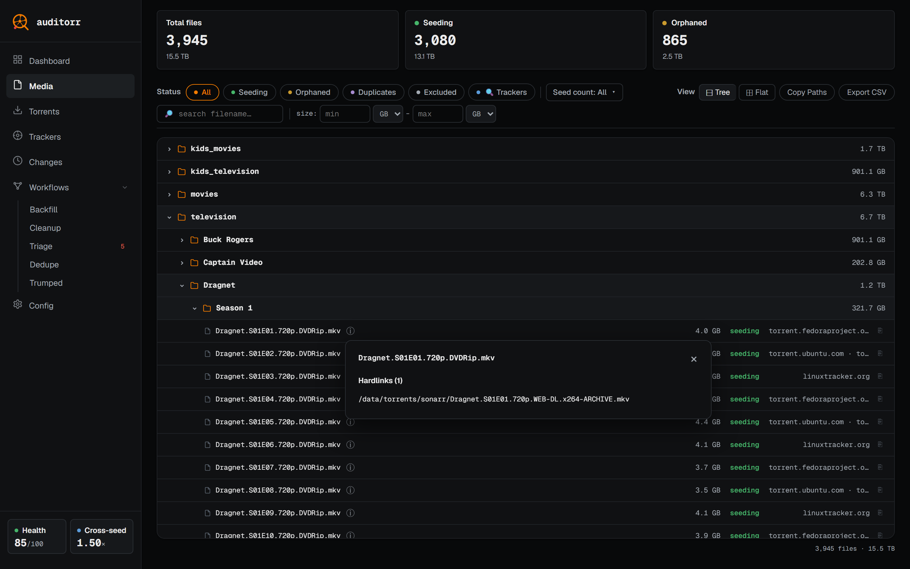
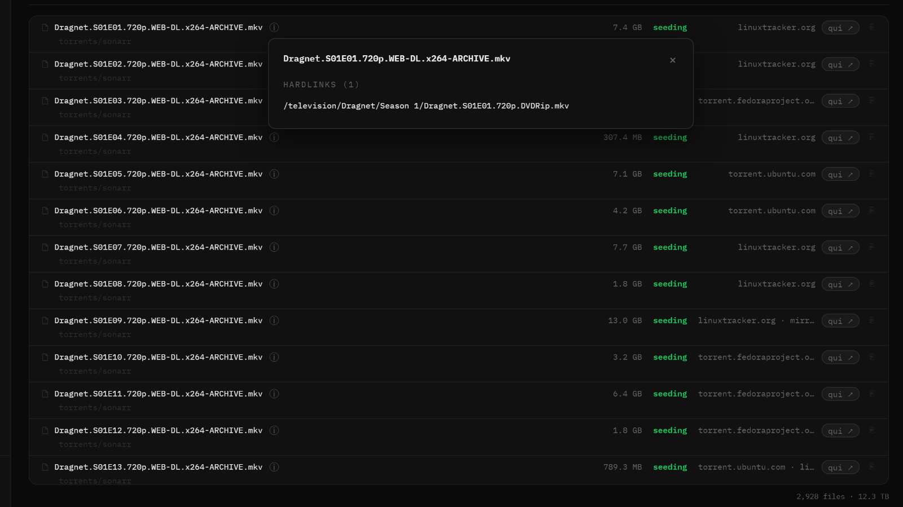
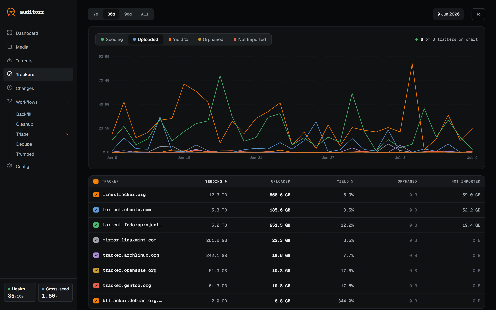
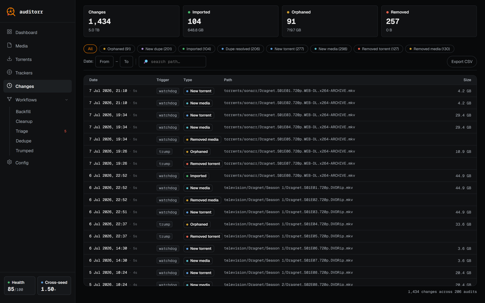

# auditorr

**A media library audit tool for qBittorrent / qui + Sonarr / Radarr.**
Library health score, per-tracker analytics, cross-seed effectiveness, and
a file-level change log between audits.

<p align="center">
  <a href="docs/dashboard.png">
    
  </a>
</p>

---

<table>
  <tr>
    <td width="50%" valign="top">
      <a href="docs/feature-media.png"></a>
      <p><b>Media explorer</b><br>
      Tree or flat view of your library. Click a file to see every hardlink
      sibling and which tracker is seeding it — answer <i>"is this episode
      actually linked to my downloads?"</i> in one click.</p>
    </td>
    <td width="50%" valign="top">
      <a href="docs/feature-torrents.png"></a>
      <p><b>Torrents</b><br>
      Every file qBittorrent / qui is seeding, with tracker, status, and
      reverse hardlink lookup. A <code>qbit/qui ↗</code> chip per row
      deep-links to that torrent in your client.</p>
    </td>
  </tr>
  <tr>
    <td width="50%" valign="top">
      <a href="docs/feature-trackers.png"></a>
      <p><b>Trackers</b><br>
      Per-tracker analytics: size seeded, 30-day uploaded, <b>yield %</b>
      (uploaded ÷ seeding), orphaned, not imported, and an uploaded trend
      sparkline. Deep-link into the explorer pre-filtered by tracker.</p>
    </td>
    <td width="50%" valign="top">
      <a href="docs/feature-changes.png"></a>
      <p><b>Change log</b><br>
      File-level diff between every consecutive audit, kept indefinitely.
      Filter by type (orphaned / imported / new / removed), search by path,
      export CSV. The fastest way to see why your score moved.</p>
    </td>
  </tr>
</table>

---

## Workflows <sub><sup>NEW IN 1.6.0</sup></sub>

The dashboard tells you what's wrong; **workflows** fix it.

**Backfill** targets *orphaned media*: files on disk with no hardlink to a
seeding torrent and no way to grow one (trumped, dead tracker, your own
rip). Search the same title on the tracker you want, grab a version that
actually seeds, and swap it in via Sonarr / Radarr — turning dead weight
into a properly seeding upgrade.

---

## Install

### Unraid

auditorr is on **Unraid Community Apps** — search for `auditorr` in the
Apps tab and install in one click.

- **WebUI:** `http://[IP]:[PORT:8677]/`
- **Appdata:** `/mnt/user/appdata/auditorr/data` → `/app/data`
- **Data:** `/mnt/user/data` → `/data` (read-only)

### Docker Compose

```yaml
services:
  auditorr:
    image: ghcr.io/thrill-burn/auditorr:latest
    container_name: auditorr
    restart: unless-stopped
    ports:
      - "8677:8677"
    volumes:
      - ./data:/app/data
      - /path/to/media:/data/media:ro
      - /path/to/torrents:/data/torrents:ro
```

<details>
<summary><b>Build from source</b></summary>

```bash
git clone https://github.com/thrill-burn/auditorr.git
cd auditorr
docker build -t auditorr .
docker run -d \
  --name auditorr \
  -p 8677:8677 \
  -v /path/to/appdata:/app/data \
  -v /path/to/media:/data/media:ro \
  -v /path/to/torrents:/data/torrents:ro \
  auditorr
```

</details>

---

> [!IMPORTANT]
> The Hardlinked Media score assumes you use hardlinks between your torrent
> folder and your media library — the
> [TRaSH Guides](https://trash-guides.info/File-and-Folder-Structure/) folder
> structure. Without hardlinks, this score is 0 regardless of how healthy
> the rest of your library is.

---

## License

MIT — see [LICENSE](LICENSE).
