# auditorr

**An audit tool for hardlinked media libraries using qBittorrent / qui + Sonarr / Radarr.**
A dashboard with health score, per-tracker analytics, and cross-seed effectiveness 
tells you what's wrong with your library. Five automated workflows fix it.
Built to stay light on memory, it runs on **500+ TB** libraries.

<p align="center">
  <a href="docs/configuration.md">Configuration</a> ·
  <a href="docs/remote-access.md">Remote access</a> ·
  <a href="docs/troubleshooting.md">Troubleshooting</a>
</p>

<p align="center">
  <a href="docs/dashboard.png">
    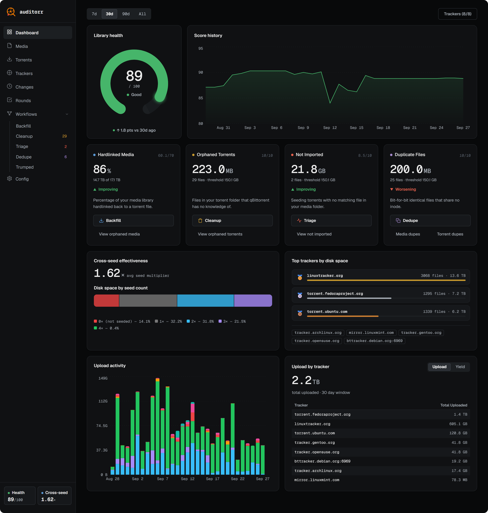
  </a>
</p>

---

## What's new in 1.8.0

- **Safer workflows** - all five were reviewed end to end. A torrent client or Sonarr / Radarr that doesn't answer can no longer make files look orphaned, unimported or safe to delete; auditorr says "could not check" instead of guessing. [Full list](CHANGELOG.md).
- **Bad scans aren't saved** - if your client stops answering, a drive isn't mounted yet, or torrents vanish overnight, your last good results stay put and auditorr tells you what to fix.
- **Deletes and hardlinks check again before acting** - Cleanup asks your client again before building a delete script, Triage and Trumped keep any file something still uses, and Trumped grabs the replacement before removing anything. Both scripts now have `--dry-run` and are safe to run twice.
- **One consistent UI** - every button, filter and heading comes from one set, and warning boxes that had silently lost their borders are back.

Upgrading needs no configuration changes. From 1.7.0 or earlier? 1.7.1 [closed off-LAN API access by default](docs/remote-access.md) - LAN is unaffected.

---

<table>
  <tr>
    <td width="50%" valign="top">
      <a href="docs/feature-media.png">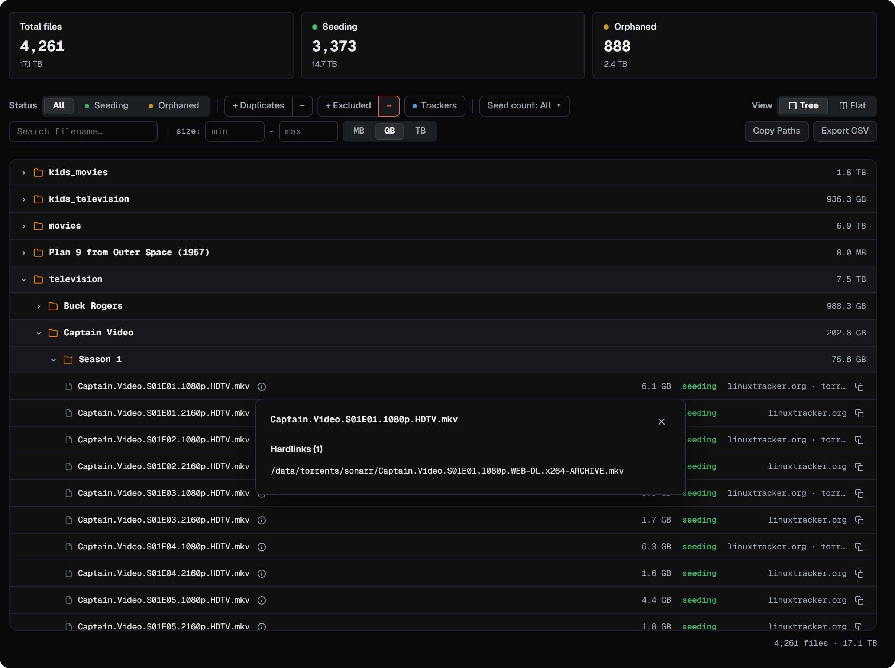</a>
      <p><b>Media explorer</b><br>
      Tree or flat view of your library. Click a file to see every hardlink
      sibling and which tracker is seeding it.</p>
    </td>
    <td width="50%" valign="top">
      <a href="docs/feature-torrents.png">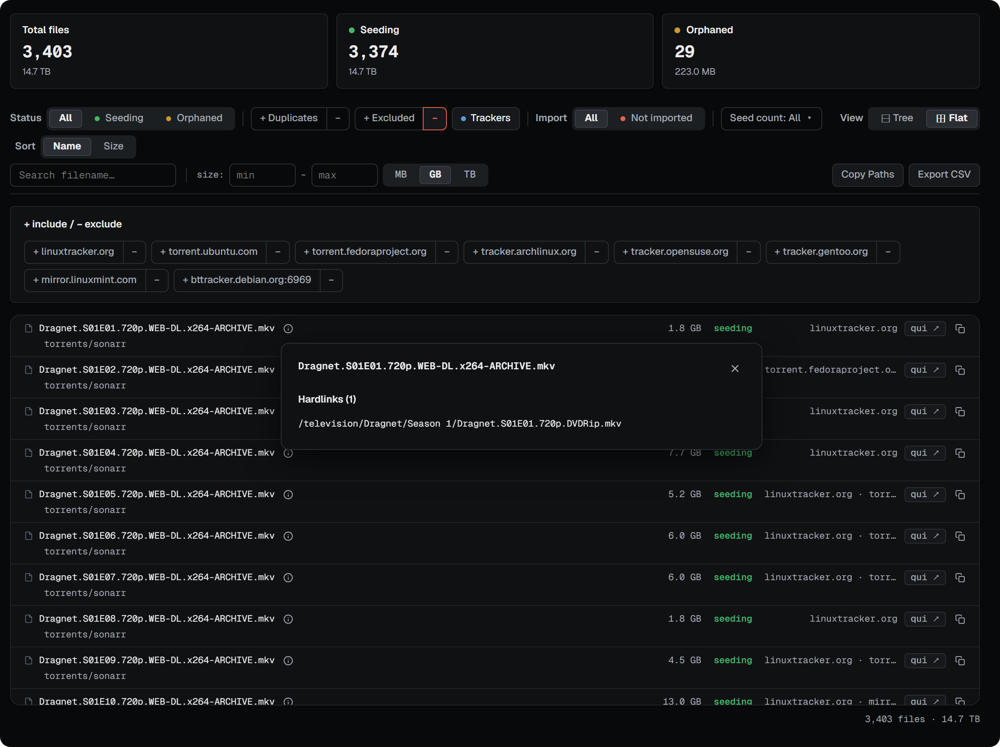</a>
      <p><b>Torrents</b><br>
      Every file qBittorrent / qui is seeding, with tracker, status, and
      reverse hardlink lookup.</p>
    </td>
  </tr>
  <tr>
    <td width="50%" valign="top">
      <a href="docs/feature-trackers.png">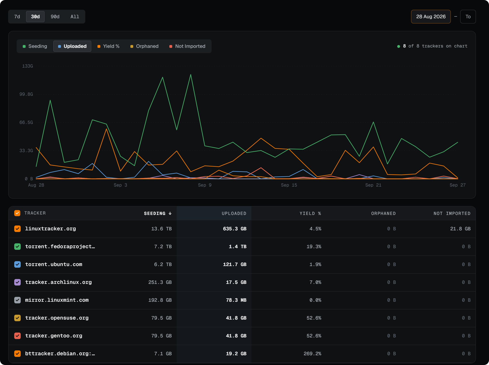</a>
      <p><b>Trackers</b><br>
      Configurable chart of per-tracker analytics. Deep-link into the explorer pre-filtered
      by tracker.</p>
    </td>
    <td width="50%" valign="top">
      <a href="docs/feature-changes.png">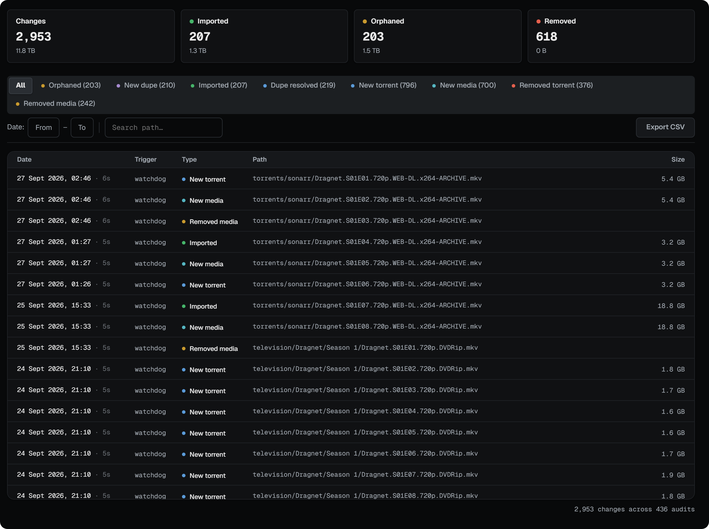</a>
      <p><b>Change log</b><br>
      File-level diff between every consecutive audit, kept indefinitely.</p>
    </td>
  </tr>
</table>

---

## Workflows

The dashboard tells you what's wrong; **workflows** fix it. **Rounds** tells you
which one to open.

### Rounds

Every workflow in one list, in a fixed order: **Baseline** to clear and then
watch, **Ongoing** that never runs out, and **On demand** for when a tracker
asks. Underneath sit 750+ **useless prizes** in the spirit of Progress Quest,
awarded for work you were going to do anyway and never taken back.

<p>
  <a href="docs/rounds.png">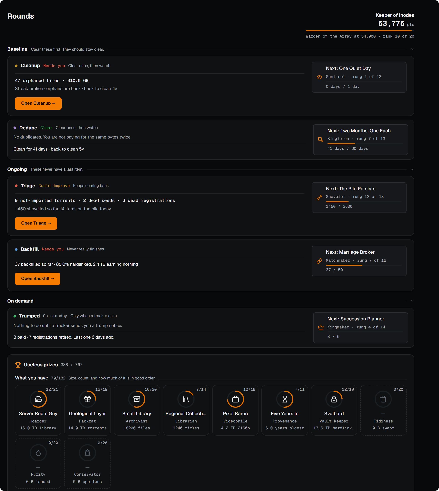</a>
</p>

### Backfill

Targets *orphaned media*: files on disk with no hardlink to a seeding torrent
and no way to grow one (trumped, dead tracker, your own rip). Search the same
title on the tracker you want, grab a version that actually seeds, and swap it
in via Sonarr / Radarr.

<p>
  <a href="docs/backfill-config.png">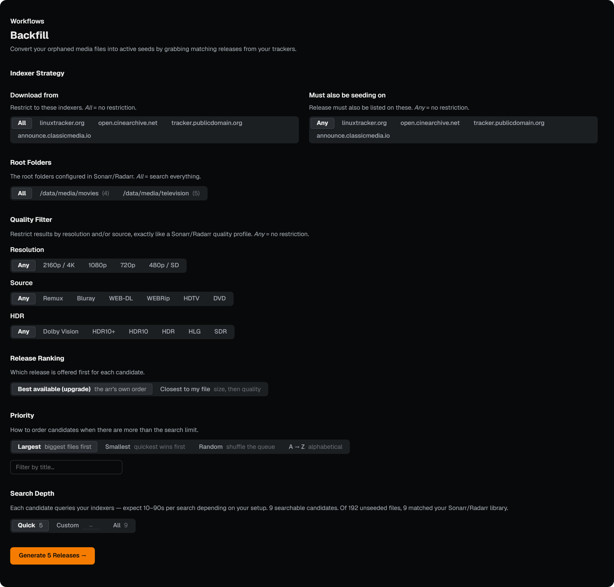</a>
</p>

### Cleanup

Targets *orphaned torrent files*: files in your torrent folder the client has
no torrent for. Review them grouped by release folder, then generate a reviewed
delete script — or exclude the ones you put there on purpose.

<p>
  <a href="docs/workflow-cleanup.png">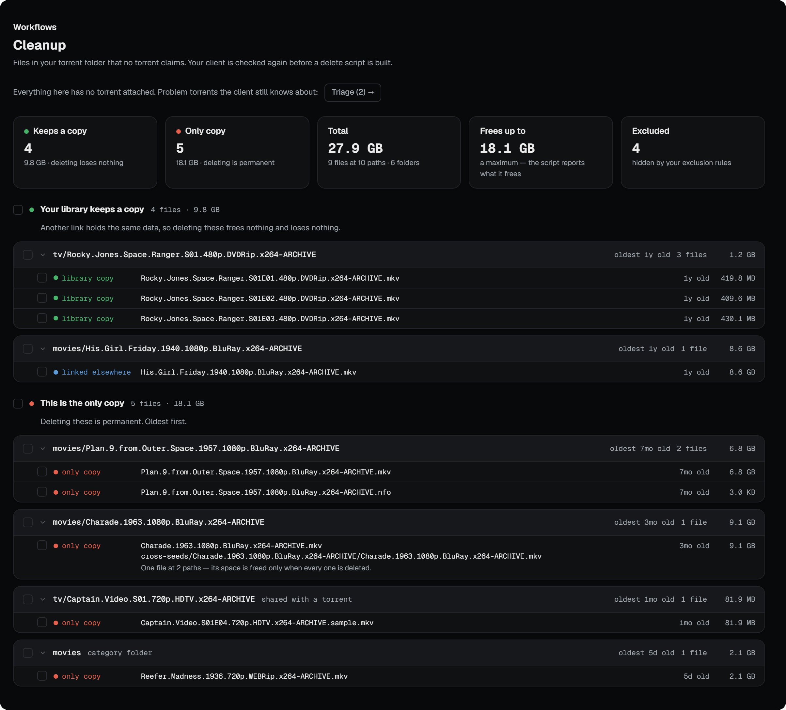</a>
</p>

### Triage

Explains every problem torrent and what to do about it: dead seeds, dead
registrations, unregistered, superseded quality, pending imports, and not in
library. Trigger a Sonarr/Radarr rescan, exclude, or delete torrents and their
files directly through qBittorrent / qui.

<p>
  <a href="docs/workflow-triage.png">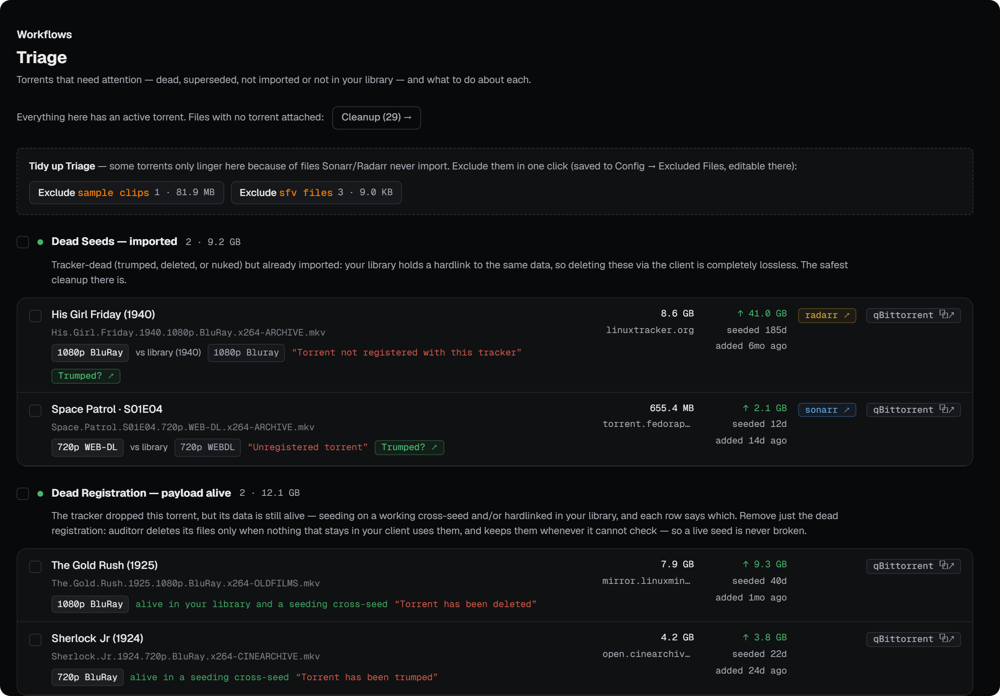</a>
</p>

### Dedupe

Targets *duplicate files*: review duplicate groups and generate a script that
replaces copies with hardlinks, verified with `cmp` before linking.

<p>
  <a href="docs/workflow-dedupe.png">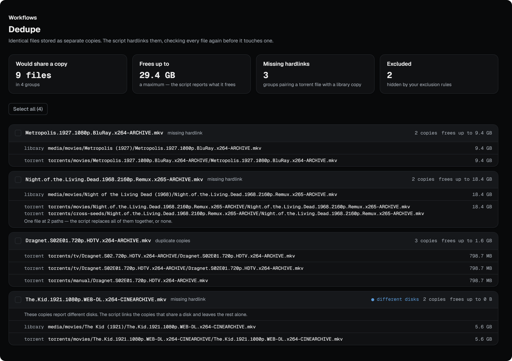</a>
</p>

### Trumped

Automates the private-tracker trump swap. Paste the tracker's "this release has
been trumped" PM; auditorr parses the old and new release names, finds the
entire hardlink group (every cross-seed of the old content), grabs the exact
replacement through Sonarr/Radarr, and only then removes the old group from the
client with its files — wizard-style, confirmed at every step.

<p>
  <a href="docs/workflow-trumped.png">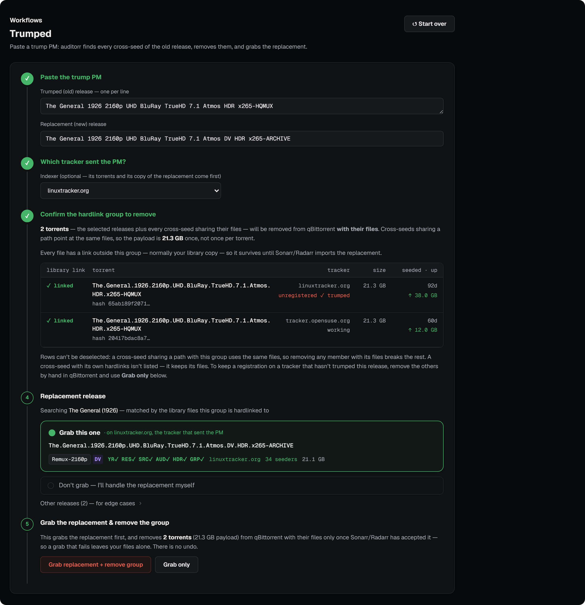</a>
</p>

---

## Install

### Unraid

auditorr is on **Unraid Community Apps** — search for `auditorr` in the
Apps tab and install in one click.

- **WebUI:** `http://[IP]:[PORT:8677]/`
- **Appdata:** `/mnt/user/appdata/auditorr/data` → `/app/data`
- **Data:** `/mnt/user/data` → `/data` (read-only)

### Docker Compose

```yaml
services:
  auditorr:
    image: ghcr.io/thrill-burn/auditorr:latest
    container_name: auditorr
    restart: unless-stopped
    ports:
      - "8677:8677"
    volumes:
      - ./data:/app/data
      - /path/to/media:/data/media:ro
      - /path/to/torrents:/data/torrents:ro
```

<details>
<summary><b>Build from source</b></summary>

```bash
git clone https://github.com/thrill-burn/auditorr.git
cd auditorr
docker build -t auditorr .
docker run -d \
  --name auditorr \
  -p 8677:8677 \
  -v /path/to/appdata:/app/data \
  -v /path/to/media:/data/media:ro \
  -v /path/to/torrents:/data/torrents:ro \
  auditorr
```

</details>

Something not working? See [Troubleshooting](docs/troubleshooting.md).

---

> [!IMPORTANT]
> The Hardlinked Media score assumes you use hardlinks between your torrent
> folder and your media library — the
> [TRaSH Guides](https://trash-guides.info/File-and-Folder-Structure/) folder
> structure. Without hardlinks, this score is 0 regardless of how healthy
> the rest of your library is.

---

## License

MIT — see [LICENSE](LICENSE).
