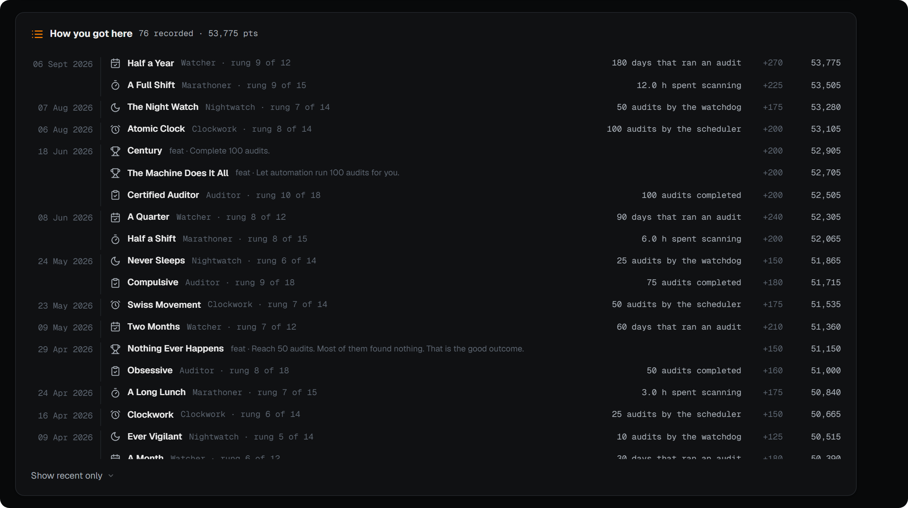

# Workflows

The dashboard tells you what's wrong. Workflows fix it.

Four of them correspond directly to the four dashboard cards, in the same order
and the same colors. The fifth, Trumped, has no card — it starts from a tracker
PM rather than from an audit finding.

| Workflow | Targets | Ends with |
| --- | --- | --- |
| [Backfill](#backfill) | Media with no torrent behind it | A grab in Sonarr/Radarr |
| [Cleanup](#cleanup) | Torrent files with no torrent | A delete script you review |
| [Triage](#triage) | Torrents that are in some kind of trouble | A rescan, an exclusion, or a client delete |
| [Dedupe](#dedupe) | The same bytes stored twice | A script that replaces copies with hardlinks |
| [Trumped](#trumped) | A trumped release and its cross-seeds | The old group gone, the replacement grabbed |

Nothing here acts on its own. Every workflow ends with either a script you read
before running, or a confirmed action on selections you made.

---

## Rounds

**Rounds** is the index for the five. It's the page to open when you know
something needs doing but not which thing.

Each workflow gets one row, in a state auditorr works out from your last audit:

| State | Means |
| --- | --- |
| **Needs you** | Over the threshold you configured for that component. |
| **Blocked** | Can't run until you finish something in Config. |
| **Could improve** | Under the threshold, but there's still something there. |
| **Clear** | Nothing to do. The row stays, so you know it's being watched. |
| **On standby** | Trumped only. It starts when a tracker PMs you, not before. |

The rows sit in three fixed sections, and the sections are the point:

- **Baseline** — Cleanup and Dedupe. Clear these once at the start, then keep an
  eye on them. They collapse to a single line once they're clear.
- **Ongoing** — Triage, then Backfill. These never have a last item. New
  downloads keep refilling Triage, and a library that keeps growing keeps
  finding new gaps for Backfill.
- **On demand** — Trumped. Nothing to do until a tracker asks.

The order never changes between visits, and it isn't ranked by whichever number
is biggest today. Hardlinked Media is 70 of the 100 health points because it's
the *hardest* thing to fix, not the first — sorting by score would hand a new
install the slowest workflow in the app as step one.

### Useless prizes

Under the work is a shelf of prizes, and the heading is not being modest: over
650 tiers across 42 ladders, plus 109 one-off feats, for things like how much you
have, how much you've given back, and how long auditorr has been running. Every
rung is named rather than numbered — the joke only works if it's specific — and
each medallion shows which rung you're on out of how many, and says what its
number counts, because a name like *Geological Layer* means nothing on its own.
Open one and you get the full ladder: every rung named, with the threshold that
unlocks it.

The shelf tries hard not to go dead once your library is in good shape, which is
the point at which a prize layer usually gives up on you. Several ladders exist
specifically for that: **Conservator** is the largest library you've ever held
with nothing at all wrong with it, **Atlas** multiplies everything you seed by
how long you've seeded it (the one number that can't be bought — 20 TB held for
five years beats 500 TB held for three weeks), **Old Faithful** is your
longest-lived single torrent, and **Fire Brigade** counts messes you cleared
within a day of them appearing, because a library that stays clean never gets
another chance to kill one.

Each workflow row also carries one prize of its own, shown beside the work, and
**none of them is measured in bytes** — a prize that grows when you buy a drive
isn't a prize for anything. Cleanup and Dedupe each get a pair: how long you've
held the clean state (**Sentinel**, **Singleton**) and how many times you've had
to take it back (**Exterminator**, **Clone Hunter**). Triage counts items
shovelled off the pile (**Shoveler**) and Backfill counts files you found a
torrent for (**Matchmaker**), because those two never finish. Trumped tallies
swaps you complied with (**Kingmaker**).

They're monotonic: prizes are awarded for what you've done and are never taken
back if your library shrinks or a count climbs again. Nothing about them appears
anywhere else in the app.

### The record

Under the shelf is **The record**: every rung and every feat, newest first, with the
day it landed, what it was worth, and a running points total down the right that
ends on the same figure as the rank at the top of the page. The shelf is what
you have; this is what you did, and when. It shows the last few and expands to
everything.

Each row also says what it took, in full: `25.0 TB in the media library`, `30
days without an orphan`, `500 audits by the watchdog`, `72.0 h spent scanning`.
A name like *Geological Layer* is a punchline with no setup, and *rung 12 of 21*
only says where it sits on its ladder. A feat has no threshold, so it shows the
condition it was awarded on instead.

If you upgraded into this, the record isn't empty. On the first audit afterwards
auditorr replays your audit log and dates everything that log can prove — audits
completed, your best score, days observed, streaks at 90 and 100, scans by the
watchdog, the scheduler and by hand, hours spent scanning, peak RAM. On a
long-running install that is usually over a hundred entries going back to your
first scan.

The rest genuinely can't be dated afterwards. auditorr keeps no day-by-day
record of library size or file counts, so there is no honest answer to "when did
I pass 25 TB" — those are summed into one line at the foot of the record saying
how many rungs and feats you were already holding. Everything from that point on
is dated as it happens.

---

## Backfill

**Targets orphaned media**: files in your library with no hardlink to any
seeding torrent — a trumped release, a dead tracker, a rip you made yourself.
They cost you disk space and return nothing.

Backfill matches those files against your Sonarr/Radarr library, then searches
your indexers for a version that is actually seeding.

### Season packs and single episodes

A Sonarr season is searched as **one season pack only when every episode file
Sonarr holds in that season is unseeded**. Otherwise each unseeded episode is
searched on its own. The rows say which: `S01 season pack · 10 ep`, or `S01E05`.

This matters more than it looks. A pack grabbed to backfill one episode of a
season whose other nine are already seeding downloads the whole season, and
importing it replaces all ten library files — so the nine torrents that were
hardlinked to them become orphans, and the health score falls on two counts at
once. An episode search can still turn up a season pack or a multi-episode
release, and those are left off an episode row. Where Sonarr hasn't numbered
every file of a show, auditorr can't show that a season is fully unseeded, so
it searches episode by episode.

### Ranking

**Closest to my file** (the default) puts first the release that looks like the
file you already have: an exact size match, then one within 1% (a scene
torrent's `.nfo` and sample), then the same quality, then the same HDR, then
the most seeders. Each release shows its size against your file (`= exact`,
`+1.2 GB`) and whether size, quality and HDR agree. **Best available
(upgrade)** keeps Sonarr/Radarr's own order — custom format score, quality,
seeders — for when you mean to upgrade while you backfill.

Results can also be filtered by resolution, source and HDR format.

### Grabbing and importing

Grabbing hands the release to Sonarr/Radarr, which downloads and imports it
normally — the new torrent hardlinks into the library and the file stops being
orphaned. When the arr parks the download because it isn't an upgrade (usual
for a backfill, since you already have this content), auditorr imports it
anyway — but only over the episodes that row was for, and always as a copy, so
nothing is moved out from under a seeding torrent. If the arr doesn't say where
the download is, or auditorr can't tell which episodes the row covered, it stops
and asks you to finish the import in Sonarr/Radarr rather than guessing.

A grab that fails because the release has dropped out of the arr's cache is
searched again and retried once. Any other failure is shown as it is — a
timeout may be a grab that actually went through, and retrying it would
download the release twice. For the same reason, a release already in the
arr's queue isn't grabbed again unless you click **anyway**.

### Runs

A search keeps running if you leave the page, and Backfill picks it back up when
you come back in the same browser tab. Starting a second search while one is
running shows you the running one instead of stopping it. A search nobody is
watching stops itself after ten minutes, and a finished one is kept for an hour.

### The rest of the page

**Root Folders** are the root folders configured in Sonarr/Radarr; a file under
none of them is grouped under **Other**.

**Search Depth** reports two different units in two sentences: candidates (a
season pack is one) and files. Of the unseeded files that didn't match your
library, it separates subtitles, artwork and other files no arr indexes from
**video files that didn't match**, which are the number worth acting on. If
little of your library matched, a path mapping is the usual cause. If most of
it did, those videos are files Sonarr/Radarr don't track at those paths — a
title they don't manage, or manage somewhere else.

**Indexer strategy** lets you say "download from these indexers, but only if the
release is also on that one" — useful when you want to satisfy one tracker's
seeding requirements using another's copy. Downloading a release from one of
those indexers counts as it being listed there. Filter preferences persist
between visits.

---

## Cleanup

**Targets orphaned torrent files**: files sitting in your torrent folder that
your client has no torrent for. Nothing is seeding them and nothing is
protecting them.

They're grouped by release folder so you review whole releases rather than
individual files. Select what you want gone and generate a delete script — plain
bash, using paths relative to your torrent directory, with a working-directory
guard at the top. Read it, then run it wherever you like.

A group marked **loose files** isn't a release — those files sit directly in a
category directory such as `movies/`, which is where qBittorrent saves
single-file torrents by default. They're grouped for convenience only, and
excluding them writes one rule per file rather than a folder rule, because a
category directory is shared with your media library.

If a group is something you put there deliberately, **Exclude** it instead and
it stops being counted against you. You're shown the exact rules first; they
land in [Config → Excluded Files](configuration.md#excluded-files--folders).

> Cleanup deals only with files your client doesn't know about. If a torrent
> exists, it belongs to [Triage](#triage) — deleting files under a live torrent
> just makes it recheck and download them again.

**Files still being downloaded are not orphans, even when their path says
otherwise.** Two optional qBittorrent settings move a file away from where the
client's file list says it will end up: *Append .!qB extension to incomplete
files* renames it while it's in flight, and a separate incomplete directory puts
it somewhere else entirely until it finishes. Either one breaks the path match
auditorr uses, so a file being actively written could appear here at whatever
partial size it had reached — and deleting that makes your client error the
torrent and start over. auditorr now accounts for both spellings and follows the
client's own answer for where a torrent's data currently lives. Neither setting
is part of the [TRaSH](https://trash-guides.info/) layout, so a by-the-guide
install was never affected.

---

## Triage

**Explains every problem torrent and what to do about it.** This is the busiest
page, because "my torrent isn't imported" has about six different causes and
they need six different responses.

| Verdict | What it means | Usual response |
| --- | --- | --- |
| **Dead seed — imported** | The tracker has dropped the torrent, but the file was imported and your library hardlink still holds the data. | Delete via the client. Lossless — the library keeps the file. |
| **Dead registration** | This particular registration is dead, but the payload is alive via a working cross-seed or the library copy. | Delete this registration; the data stays. |
| **Unregistered** | The tracker says unregistered, and it was never imported. | Delete, or investigate why it never imported. |
| **Superseded** | Your library already has this title. Sub-grouped by whether the torrent is higher, same, or lower quality than the library file. | Keep the higher one; remove the loser. Same quality? [Force import](#rescan-vs-force-import). |
| **Import pending** | Sonarr/Radarr manage the title but no library file exists yet. | Trigger a rescan. |
| **Could not check** | A Sonarr/Radarr instance didn't answer, so whether your library holds these is unknown. Only appears while something is unreachable. | Fix the connection and reload. Don't act on these meanwhile. |
| **Not in library** | Neither arr knows about it, under its own title or any alternate title they hold. | Import it, exclude it, or remove it — but note these files are the only copy. |

*Not in library* means "no arr has ever heard of this", so it is deliberately
**unreachable while any arr is unreachable** — those rows go to *Could not
check* instead, under a banner naming the instance. The distinction matters
because that bucket's files are the only copy you have, and "we couldn't ask" is
not an answer. Positive matches are unaffected: a title that *did* resolve still
reads *Superseded* or *Import pending* as normal.

**Downloads that haven't finished are not listed.** A torrent at 0% has no
library file, which is the literal definition of the Not Imported pile, so the
newest thing in your client used to arrive here at its full final size with a
delete button under it. auditorr now asks your client whether the payload is
actually complete — a separate question from whether the torrent is paused,
seeding or downloading, since a *paused* half-finished torrent looks exactly
like a paused finished one — and leaves unfinished ones alone until they're
done. If your client gives no usable completion figure at all, the row is still
shown, tagged **completion unknown**: a row you can see and judge beats one that
quietly vanished.

Titles are matched against the **alternate titles** Sonarr and Radarr already
store, not just the one they display. That matters for non-English content,
which is almost always released under its original-language name: a season
released as `No.tengo.miedo.S01…` resolves to the series Sonarr calls *I'm Not
Afraid*, and reads as *Import pending* rather than *Not in library*. An exact
title match always takes priority.

### How Triage loads

The page renders immediately from data captured during the last audit, making
zero calls to your torrent client. It then verifies every item's live tracker
health in background batches — rows show `···` until their batch answers.

That's deliberate: tracker health is the one thing that can't be trusted from a
snapshot (a torrent that was dead last night may be fine now), while everything
else can. Recovered torrents disappear from the list as their batch confirms
them. If verification fails you get an explicit "showing audit-time data" notice
and a Retry button, never a quiet guess.

### Rescan vs force import

Two actions get a file into your library, and they reach different things.

**Trigger Rescan** asks Sonarr/Radarr to look at the release folder and import
what they find. That works when the arr has no file for the title yet — the
*Import pending* case. It imports by hardlink, so your torrent keeps seeding.

It does **not** work when the arr already has a file. Sonarr and Radarr compare
every candidate against what they hold and refuse anything that isn't strictly
better — including a release of *identical* quality, and including a normal
release offered against an existing REPACK. Rescanning cannot get past that; the
answer is the same every time.

That refusal used to be invisible, because the arrs report a scan as "completed"
whether they imported everything or nothing. auditorr now asks what the arr
decided and tells you in plain words:

> Nothing will import — Not a quality revision upgrade for existing movie file(s)

**Force import** is the way past it. It uses the arr's own *Import Anyway*,
replacing the library file with this release. It appears on superseded items
that are the **same quality** as the file you already have — typically after a
trump, where the tracker made you swap one release for an equivalent one.

If the torrent is genuinely worse than what you have — 1080p against a 2160p
library file, a WEB-DL against a Bluray — the action isn't offered at all. That
refusal isn't a bug to work around; those torrents are fine as cross-seeds, and
your library is right to keep the better copy. If you do want one of them anyway
— a corrupt library file, or a 1080p Remux auditorr ranks below a 2160p WEB-DL
because resolution decides first — use Sonarr/Radarr's own Manual Import, which
handles one deliberate file at a time.

> Force import replaces a file you already have. It's the one Triage action that
> changes your library rather than your torrent client, so it's deliberately
> narrow.

### Exclude

**Exclude** hides a torrent's files from future audits — it's "stop telling me
about this", not "fix this", and it deletes nothing. You're shown the exact
rules before they're written.

Where auditorr can establish that a folder holds nothing but this torrent's
files, you get **one rule for the folder**. Otherwise you get one rule per file.
Two things stop the folder form being used: the torrent is **partly imported**,
so its release folder also holds the files that imported fine; or the folder
holds something else as well — another torrent, an orphan, or it's a category
directory shared with your media library.

It isn't offered on **Dead Registration** rows at all. Those rows are about a
registration your tracker dropped, but the files under them belong to a
cross-seed that is alive and still seeding — hiding the file wouldn't retire the
registration, and the registration is what needs removing.

### Exclusion suggestions

When torrents linger only because of files Sonarr/Radarr will never import,
Triage offers one-click filters built from your actual files: non-video
sidecars (`.sfv`, checksums), scene sample clips, and full-disc rip structures.
Clicking one writes a real exclusion into
[Config → Excluded Files](configuration.md#excluded-files--folders), where you
can see and undo it. Subtitles and Extras are deliberately never suggested.

---

## Dedupe

**Targets duplicate files**: bit-for-bit identical files that don't share an
inode, i.e. two real copies burning two lots of disk space.

Review the duplicate groups, select the ones you want collapsed, and generate a
script that replaces each copy with a hardlink to a single kept file. The script
runs `cmp` on every pair before linking, so it will refuse to collapse anything
that isn't genuinely identical.

Disc rips generate enormous numbers of identically-sized structural files, so
detection skips excluded files, skips size groups above 200 files, and records
at most 10 siblings per file. If you rip discs, turn on the disc-rip exclusion
preset and this page gets dramatically more useful.

**Unfinished downloads are never offered**, and this is the one case where the
script's `cmp` check cannot protect you. qBittorrent doesn't pad a file out as
it downloads — it writes a **sparse** file, which reports its full final size
while the parts not yet written read as zeros. Two unfinished files of the same
size whose written parts don't overlap therefore genuinely *are* identical at
that moment: same size, same fingerprint, and `cmp` agrees. Hardlink them and
both torrents write into one file and both are ruined. So detection now requires
your client to confirm a torrent is finished, and anything it can't confirm is
left out — that costs you some disk space you might have reclaimed, which is
the cheaper mistake by a wide margin.

---

## Trumped

**Automates the private-tracker trump swap.** A tracker PMs you to say your
release has been replaced; the manual version of this is finding every
cross-seed of the old release, removing them all, and searching for the new one
by hand.

Paste the PM. auditorr parses the old and new release names and walks you
through it:

1. **Pick the tracker that sent the PM** (optional). Its torrents and its copy
   of the replacement come first.
2. **Confirm the group.** auditorr queries your client live for torrents
   matching the old release, and shows you a ranked list of candidates. You
   confirm which are really yours before anything is touched.
3. **Expand to cross-seeds.** Each confirmed torrent is expanded into every
   torrent sharing its files, followed all the way through — a torrent sharing
   files with a cross-seed is in the group too. That is the whole set that has
   to go together.
4. **Pick the replacement.** auditorr finds the Sonarr/Radarr entry from the
   files the group is hardlinked to, falling back to the new release's name,
   and searches it. The exact replacement on the PM's tracker is shown as
   **Grab this one**; the rest are folded under *Other releases*.
5. **Execute.** The old group is removed via the client, the replacement is
   grabbed through Sonarr/Radarr, and auditorr follows the download into your
   library — it shows up in the **Import Jobs** panel at the bottom right, like
   a Backfill grab — then re-audits once it imports.

### What the confirm step tells you

- **Library link.** For each torrent: **✓ linked** — a link to its files exists
  outside the group, normally your library copy, so it survives the removal;
  **✗ only copy** — nothing outside the group holds at least one file, and
  removing it destroys it; **? unchecked** — auditorr couldn't see the file
  (check your torrent path mapping). An *only copy* asks you again, naming how
  much data would be destroyed. This is what makes "delete with files" safe, so
  auditorr checks it rather than assuming it.
- **Incomplete group.** If a torrent that might share these files didn't return
  a file list, the group is marked incomplete and removing it needs your
  acknowledgement. If a torrent-client instance doesn't answer at all, the swap
  stops instead.
- **The tracker's own verdict.** A torrent your tracker already reports as
  unregistered is the tracker confirming the trump.
- **Rows can't be deselected.** Cross-seeds sharing a path point at the same
  files, so removing one with its files breaks the rest. To keep a registration
  on a tracker that hasn't trumped the release, remove the others in your client
  and use **Grab only**.

Right before deleting, auditorr resolves the group **again**. If a torrent has
gone, stopped sharing the files, or joined the group since you confirmed it,
nothing is removed and you're sent back to confirm it.

**Grab only** works without
[Workflow torrent deletion](configuration.md#workflow-torrent-deletion-allow_client_delete)
turned on: it grabs the replacement and leaves the old torrents to you. A
replacement already in the arr's queue isn't grabbed twice unless you say so.

Dead seeds in [Triage](#triage) carry a **Trumped? ↗** button that opens this
page with the release filled in — a dead seed is often a trump whose PM you
missed.

**Matching never silently guesses.** Release names in PMs drift from the real
thing — `DD+ 5.1` versus `DDP5.1` — so instead of picking one and hoping,
auditorr ranks candidates and asks. Two titles must genuinely overlap, and the
year and season/episode must agree, before quality or release group are even
considered. When nothing genuinely matches, the list is **empty** and you get a
deep link into Sonarr/Radarr to do it manually — never a confident wrong answer.

auditorr never contacts your tracker. Group resolution and deletion happen
through your torrent client; search and grab happen through Sonarr/Radarr.

---

## Deleting torrents safely

Client-side deletion is off until you enable
[Workflow torrent deletion](configuration.md#workflow-torrent-deletion-allow_client_delete).
Once on, it's worth understanding what happens to files.

Cross-seeding comes in two shapes, and they behave differently:

- **Shared path** — several torrents registered against the *same* file. Delete
  that file and every one of those torrents breaks.
- **Distinct hardlinks** — each torrent has its own path, all pointing at the
  same data. Delete one link and the others are fine.

The default file handling is **auto**, which resolves the live paths and deletes
a torrent's files only where no *surviving* torrent still references them. A
shared-path cross-seed keeps its file; a distinct-hardlink cross-seed drops only
its own link; nothing is left orphaned either way.

The confirmation dialog shows every torrent's hash, tracker, seeding time, size,
and file paths, and marks which members share a path — so "deleting one is
always safe for the others" is never something you have to assume.
